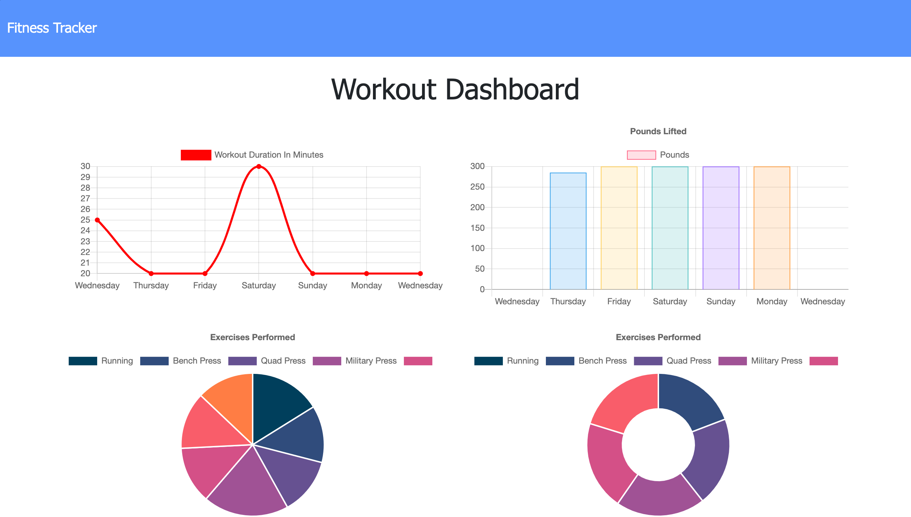

<h1 align="center">Work tracker</h1>

 

## Description 
Workout-Tracker provides the user with plenty of functionality to help them reach their fitness goals.User are able to   
 
 * Log multiple exercises in a workout
 * Track the name, type, weight, sets, reps, and duration of each exercise
 * Track the distance traveled if the exercise was cardio based
 * View past workout

 

## Screenshot

  

## Table of Contents

- [Description](#description)
- [Installation](#installation)
- [Usage](#usage)
- [License](#license)
- [Contribution](#contributing)
- [Tests](#tests)
- [Questions](#questions)

## Installation
Users can view the deployed project [here](https://young-lake-51435.herokuapp.com/). If you intend to iterate on the project, besides downlodaing the repo to your machine, be sure to run `npm install` in the root diractory and to also have MongoDB installed and ready.

## Usage
The application best serves those interested in exercies by allowing users to create workout plans.

## License
 
This application is covered by the MIT license.

## Contributing
[Gary Chen](https://github.com/GaryChen513)

## Tests
no

## Questions
Contact me with any question: [Github](https://github.com/GaryChen513), 
[Email](mailto:garychen19970513@gmail.com)
